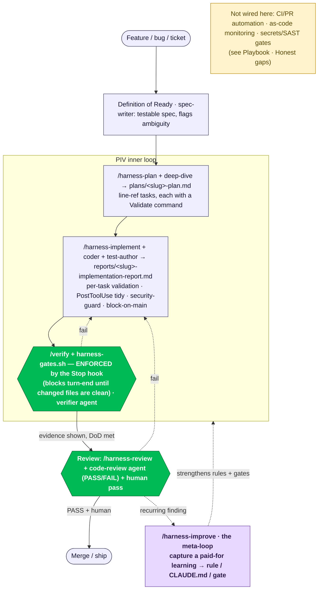

# The harness Developer Workflow (with the harness)

*You have a change to make. This is the loop — command by command, agent by agent — with the
harness doing the remembering, checking, and enforcing for you.*

This is the **single source of truth for the loop.** For *what the harness is and how it's built in
this repo* (the layers, the agents/gates/hooks, the honest gaps) → the
[AI Harness Playbook](./AI_Harness_Playbook.md).

`harness` is an **Electron + Vite + TypeScript** desktop app (main / preload / renderer, node-pty
terminals, better-sqlite3, git-worktree management), built in **phases against a spec**.

---

## 0. The shape in one screen

The inner loop is **PIV — Plan → Implement → Validate** (+ Review). Each phase leaves a **durable
artifact** so the hand-off is the artifact, not the chat transcript — run each phase in a fresh
context (`/clear` between them). One loop runs the other way: **`/harness-improve`** feeds a lesson
paid for downstream (a recurring review finding, a footgun) back *up* into the rules and gates.



---

## 1. Before you start — what loads itself

You don't re-teach the codebase each session. At session start the harness auto-loads the **root
`CLAUDE.md`** + the **nearest nested `CLAUDE.md`** (`src/main/ipc`, `src/main/pty`, `src/main/git`),
plus `.claude/rules/{security,architecture,conventions}.md` (tagged `[GATE]`/`[REVIEW]`).

Two setup facts:
- **Native modules** (`node-pty`, `better-sqlite3`) need `electron-rebuild` — run `npm run rebuild`
  after install or an Electron bump, or the app/tests won't boot.
- **Detached worktree caveat.** This checkout's `git` link may be broken; when it is, the git-based
  hooks (`block-on-main`, `stop-validate`) **fail open** (become no-ops). See the Playbook.

---

## 2. Definition of Ready — *spec it*

**Agent: `spec-writer`.** Turn a thin request into a testable spec and **surface ambiguity before a
line of code** (e.g. *"rename a workspace — does it rename the branch/worktree, and what happens to a
running terminal?"*). For a gnarly or cross-cutting change, follow with the **`deep-dive`** agent
(plan/risk review, unfamiliar-code mapping).

## 3. PLAN — *how we build it here* (PIV step 1)

**`/harness-plan <feature-or-ticket>`** → a durable **`plans/<slug>-plan.md`**: affected files with
line refs, ordered tasks (each with a pattern reference, a gotcha, and an exact **`Validate:`**
command), the validation gate, and acceptance criteria. **No code is written here.** It also picks
the **execution strategy** (single-agent vs parallel subagents vs a team) and records it in an
`## Execution Strategy` section that `/harness-implement` drives. Defaults to the lightest option.

## 4. IMPLEMENT — *write it* (PIV step 2)

**`/harness-implement plans/<slug>-plan.md`** executes each task in order, runs the task's
`Validate:` immediately, and writes **`reports/<slug>-implementation-report.md`**. **Agents:**
`coder` (production code), `test-author` (tests, *independent* of the coder — failing-first for
bugs), `frontend-designer` (renderer UI: React + Tailwind + Radix).

What fires automatically while you edit (see the Playbook for the hook table):
- **block-on-main** (PreToolUse): can't edit on `main` — branch first.
- **security-guard** (PreToolUse): hard-denies real `.env` access + recursive deletes
  (`rm -rf`, `find -delete`, `git clean -d/-f/-x`).
- **post-edit-checks** (PostToolUse, non-blocking): `prettier --write → eslint --fix` on the touched file.

> Keep the non-negotiables in view (root `CLAUDE.md`): renderer hardening, **append-only
> `src/shared/**`**, the typed IPC error boundary, a new capability wired as a channel end-to-end.

## 5. VALIDATE — *prove it, and it's enforced* (PIV step 3)

**`/verify`** — the 6-step evidence loop: restate the goal → run `bash ci/harness-gates.sh` → **name**
the `*.test.ts` that exercises the new behaviour → **show** it (a Vitest case, a script + output, or
the app / a Playwright run) → walk the Definition of Done → self-critique (weakest part, duplication,
heightened-scrutiny paths). **Agent: `verifier`** — judges *truth of completion*, refuting "done".

**Enforced, not just invoked:** the **Stop hook** (`stop-validate.sh`) runs `prettier -c` + `eslint`
on changed files and blocks the agent from finishing until they're clean (escape:
`SKIP_STOP_VALIDATE=1`).

The gate runner (subset in the inner loop; full set before review):

| Gate | Severity | Regulates | Command |
|---|---|---|---|
| `format` | BLOCKING | maintainability | `prettier -c .` |
| `lint` | BLOCKING | maintainability | `eslint .` |
| `typecheck` | BLOCKING | maintainability | `tsc -b` |
| `tests` | BLOCKING | **behaviour** | `node scripts/vitest-electron.mjs run` |
| `build` | BLOCKING | integration | `electron-vite build` |
| `deps_verify` | BLOCKING | supply-chain | `npm install --dry-run` (catches hallucinated/missing deps) |
| `deps_audit` | ADVISORY | supply-chain | `npm audit --audit-level=high` (warns, never fails) |

```bash
bash ci/harness-gates.sh                        # full gate (all of the above)
bash ci/harness-gates.sh format lint typecheck  # fast inner loop
SKIP_GATES="deps_audit deps_verify" bash ci/harness-gates.sh   # skip network-hitting gates offline
```

## 6. REVIEW — *two reviewers* (PIV step 4)

**Local:** `/harness-review` delegates the diff to the **`code-review`** agent (quality vs
`.claude/rules/`, acceptance criteria, severity-graded findings, heightened-scrutiny callouts,
PASS/FAIL) and writes `reports/<slug>-review.md`. For higher-risk work, also run the **`verifier`**
(completion-truth, distinct from quality). Then a **human pass** — two-reviewer minimum.

## 7. Improve the harness — *close the meta-loop*

**`/harness-improve`** (explicit) — when you pay for a lesson downstream, encode it so the team never
pays twice: a repo-wide footgun → root `CLAUDE.md`; a subsystem behaviour → the nearest nested
`CLAUDE.md`; a standard → a tagged line in `.claude/rules/*`; mechanically checkable *today* → a
`[GATE]` line **plus** wiring in `ci/harness-gates.sh`; a recurring work-shape → a new skill. It runs
as a **ratchet, not a wish-list**, and **proposes before it edits**. See the Playbook.

---

## 8. Agent cheat-sheet (which one do I reach for?)

| Agent | Model | Phase | Reach for it when… |
|---|---|---|---|
| **spec-writer** | sonnet | Definition of Ready | A request is thin — scope it + flag ambiguity before code |
| **deep-dive** | opus | Plan / investigate | Depth matters — plan/risk review, unfamiliar-code mapping, hard bug |
| **coder** | opus | Implement | Build/refactor production code to the house rules |
| **frontend-designer** | sonnet | Implement (UI) | Renderer UI — React + Tailwind + Radix, the process boundary |
| **test-author** | sonnet | Implement (tests) | Tests *independent* of the coder; failing-first for bugs |
| **verifier** | sonnet | Validate | Refute "done" with evidence (completion-truth) |
| **code-review** | opus | Review | Judge *quality* — rules + acceptance criteria + severity + PASS/FAIL |
| **release-notes** | haiku | Release | Turn merged PRs/commits into a changelog |
| **incident-responder** | opus | Monitor | Read-only triage of app failures (logs / IPC / git / pty / db) |

`code-review` (quality) and `verifier` (completion-truth) are deliberately separate; `test-author`
is deliberately not `coder`.

## 9. Honest gaps (what's NOT wired here)

Be candid — this harness is ported and trimmed to a desktop app. Not present today: CI / PR
automation (no GitHub Actions floor, no `/claude-review`), as-code monitoring, wired `secrets`/SAST
gates, an `evals/` baseline, and a committed MCP config. Two hooks (`block-on-main`, `stop-validate`)
**fail open while the git link is detached**. The full list + rationale lives in the
[Playbook · Honest gaps](./AI_Harness_Playbook.md#honest-gaps).
